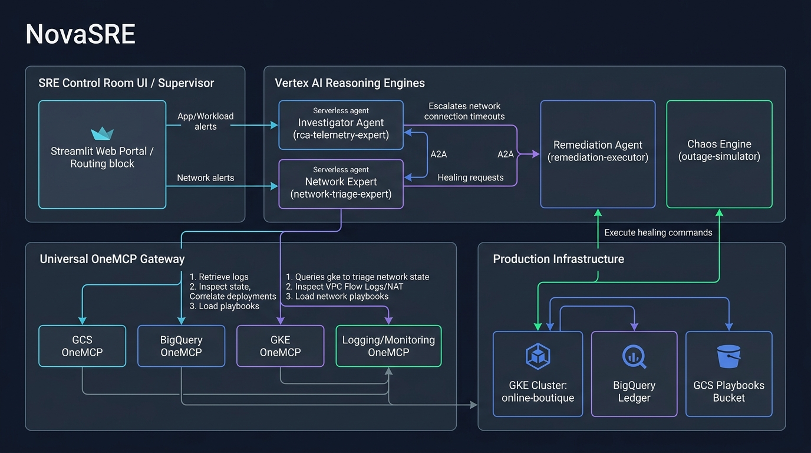
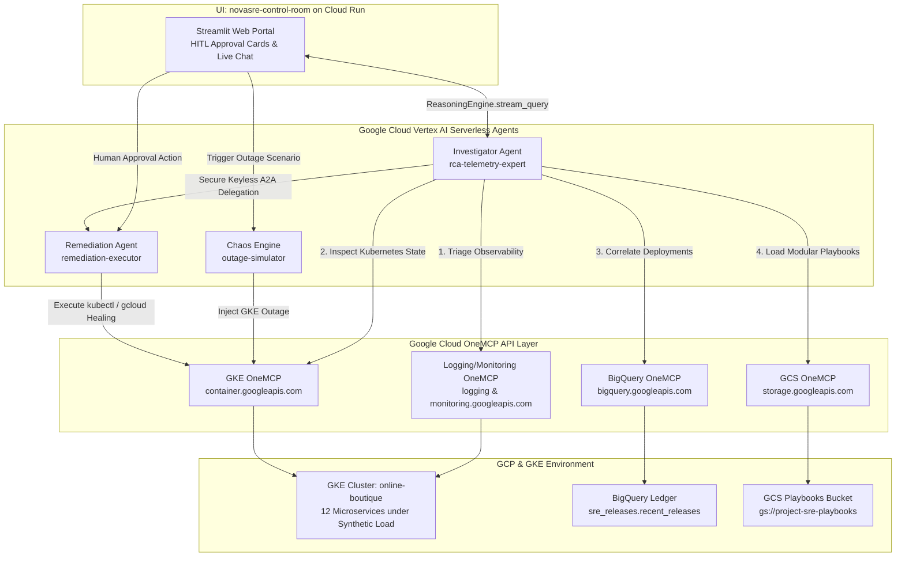

# 🛡️ NovaSRE — Autonomous Site Reliability Engineering Platform (ADK 2.0 & A2A)



Welcome to **NovaSRE**, an enterprise-grade autonomous Site Reliability Engineering (SRE) and self-healing infrastructure platform built on **Google Cloud Vertex AI Reasoning Engines (ADK 2.0)**, **Agent-to-Agent (A2A) Protocols**, and universal **OneMCP APIs**.

NovaSRE transforms cloud operations from reactive firefighting into proactive, policy-driven self-healing. The platform pairs a live **GKE Autopilot microservices cluster (`online-boutique`)** with autonomous AI agents that diagnose root causes, cross-correlate observability signals with BigQuery deployment ledgers, and execute surgical remediation under strict **least-privilege security** and **Human-in-the-Loop (`HITL`) approval gates**.

---

## 🏗️ 1. Platform Architecture & Components

The NovaSRE ecosystem consists of three specialized Reasoning Engine agents, a containerized Incident Control Room UI, a central GCS Playbook Repository, and a BigQuery Deployment Ledger interacting securely over Google Cloud API Gateways:



### Core Components Summary
1. **`rca-telemetry-expert` (The Diagnostician)**: Operates with **read-only privileges**. Performs progressive baseline triage across Cloud Logging and Monitoring (`LOGGING_MCP_SERVER`, `MONITORING_MCP_SERVER`), inspects GKE workload health (`GKE_MCP_SERVER`), queries the BigQuery Deployment Ledger (`BQ_MCP_SERVER`), and dynamically loads modular markdown playbooks from GCS (`GCS_MCP_SERVER`).
2. **`remediation-executor` (The Remediation Worker)**: The **only** identity endowed with GKE write access (`container.developer`). Executes pre-approved `kubectl` and `gcloud` healing commands when authorized by the Diagnostician or human operator.
3. **`outage-simulator` (The Chaos Engine)**: An autonomous Chaos Engineering agent that dynamically reads `app/skills/simulations/` playbooks and injects controlled outages into the `online-boutique` GKE cluster.
4. **`novasre-control-room` (The Incident Operations Center UI)**: A minimalist Streamlit web application running on Cloud Run (`$0` idle cost). Provides operators with the `💬 NovaSRE AI Companion`, real-time BigQuery ledger views, and high-visibility **Human-in-the-Loop (`HITL`) Approval Cards** (`[ ✅ Approve & Execute ]`).

---

## 🌟 2. The 4-Scenario Chaos & Remediation Matrix (`2 Auto vs. 2 Manual HITL`)

NovaSRE enforces a strictly balanced **`2 Auto-Remediation vs. 2 Manual HITL Remediation`** policy across our live GKE microservices:

| Scenario # | Scenario ID | Target Microservice | Simulated Outage Action (`outage_simulator`) | SRE Remediation Playbook (`sre-playbooks` & GCS) | UI Remediation Tier & Gate |
| :--- | :--- | :--- | :--- | :--- | :--- |
| **1** | `gke-scale-outage` | `frontend` | Drops active replicas to **`0`** (`kubectl scale deployment frontend --replicas=0`) causing 503 errors across the store. | **Playbook 1 (`gke-scale-recovery.md`)**: Scale `frontend` back up to `1` active replica. | **Tier 1 (Auto-Remediation)**:<br>Pre-approved fast-path. Auto-heals (or 1-click test). |
| **2** | `gke-bad-rollout` | `cartservice` | Pushes an invalid container revision (`cartservice:broken-v2`) causing pod `CrashLoopBackOff`. | **Playbook 2 (`gke-crashloop-rollback.md`)**: Execute `kubectl rollout undo deployment/cartservice` to revert to previous stable release. | **Tier 1 (Auto-Rollback)**:<br>Pre-approved fast-path. Auto-reverts bad rollout immediately upon correlation. |
| **3** | `gke-pod-crash` | `redis-cart` | Deletes active pods and injects a memory lock causing shopping cart database connection timeouts. | **Playbook 3 (`gke-pod-restart.md`)**: Execute a clean pod rolling restart (`kubectl rollout restart deployment/redis-cart`) to clear stuck pool locks. | **Tier 2 (Manual HITL Approval)**:<br>Requires operator confirmation via UI (`[ ✅ Approve Pod Restart ]`). |
| **4** | `gke-payment-latency` | `paymentservice` | Throttles capacity to `1 replica` under peak synthetic checkout surges, causing transaction timeouts (`>2000ms`). | **Playbook 4 (`gke-horizontal-upsize.md`)**: Scale `paymentservice` up to **`3 replicas`** (`kubectl scale deployment paymentservice --replicas=3`) to absorb transaction spikes. | **Tier 2 (Manual HITL Approval)**:<br>Requires operator confirmation via UI (`[ ✅ Approve Horizontal Upsize ]`). |

### 🛡️ The 3-Tier Resolution Hierarchy & Novel Outage Fallback

To balance execution velocity against production safety—especially when encountering unforeseen zero-day anomalies—NovaSRE orchestrates investigation and self-healing across three autonomous governance tiers:

1. **Tier 1: Autonomous Auto-Remediation (High Confidence / Low Risk)**  
   * **When it activates**: Root cause analysis precisely correlates with an established GCS Standard Operating Procedure (`SKILL.md`) or a verified bad rollout record in the BigQuery deployment ledger (e.g., stateless replica drops or broken container releases).
   * **Execution Flow**: `rca-telemetry-expert` loads the playbook and instantly delegates across Agent-to-Agent (`A2A`) protocol to `remediation-executor`. Service availability is restored in seconds with zero operator intervention required.

2. **Tier 2: Gated Human-in-the-Loop Remediation (High Confidence / High Impact)**  
   * **When it activates**: The diagnosed failure maps to an established playbook, but executing the cure involves stateful disruption, potential cache resets, or financial/resource quota scaling (e.g., restarting database connections or multiplying pod counts under surge load).
   * **Execution Flow**: The diagnostic engine prepares a detailed **Executive Resolution Brief** in the Control Room with a mandatory security checkpoint. Execution halts until an SRE reviews the evidence and clicks **`✅ Approve & Execute Action`**.

3. **Tier 3: Autonomous LLM Fallback (Zero-Day & Unscripted Anomalies)**  
   * **When it activates**: An infrastructure issue is detected that **does not match any pre-configured GCS markdown playbook or BigQuery release event** (e.g., novel network latency, strange OOM memory leaks, or unscripted configuration drift).
   * **Execution Flow**: Instead of throwing an error or failing, the platform falls back to **Tier 3 (LLM Fallback)**:
     * Leveraging its foundational Gemini reasoning capabilities, `rca-telemetry-expert` acts as an autonomous tier-3 investigator.
     * It progressively interrogates container error logs (`LOGGING_MCP_SERVER`), inspects metric deviations (`MONITORING_MCP_SERVER`), and queries live Kubernetes pod manifests (`GKE_MCP_SERVER`).
     * It dynamically formulates an unscripted, highly contextual mitigation strategy and presents its diagnostic hypothesis directly to the operator in the control room chat for HITL review and execution.

---

## 📦 3. BigQuery Deployment Ledger Correlation (`Pivot 5`)

When an anomaly occurs (`e.g. cartservice entering CrashLoopBackOff`), NovaSRE does not guess the fix. It performs **Causal Deployment Correlation**:
1. Queries the seeded BigQuery database using OneMCP (`BQ_MCP_SERVER`):
   ```sql
   SELECT * FROM sre_releases.recent_releases WHERE service_name = 'cartservice' ORDER BY timestamp_utc DESC LIMIT 1;
   ```
2. Discovers release **`REL-042`** pushed `gcr.io/google-samples/microservices-demo/cartservice:broken-v2` moments before the crashes started.
3. Cross-references this causal evidence and automatically triggers **Playbook 2 (Tier 1 Rollback)** (`undo rollout deployment cartservice`) to restore production availability in seconds.

---

## 🚀 4. Comprehensive Deployment Guide

You can deploy NovaSRE to either a **new Google Cloud project** or an **existing project** using our modular Terraform suite (`terraform/`).

* **⏱️ Estimated Deployment Time:** **`~10 to 12 minutes`** for a full stack deployment to a new project, or **`~6 to 8 minutes`** when deploying agents and the control room UI to an existing project.

### Prerequisites
* Google Cloud CLI (`gcloud`) installed and authenticated (`gcloud auth login`).
* Python `3.13+` and `terraform >= 1.5.0`.
* A Google Cloud Billing Account ID (`gcloud billing accounts list`).

---

### Path A: Deploy to a New Google Cloud Project
If starting fresh, create a new project and provision the full infrastructure (VPC, GKE Autopilot cluster, BigQuery database, GCS bucket, and Cloud Run UI):

```bash
# 1. Create a new GCP project and link billing
export GCP_PROJECT_ID="ksiri-novasre"
export BILLING_ACCOUNT_ID="your-billing-account-id"
export GCP_REGION="us-central1"

gcloud projects create $GCP_PROJECT_ID
gcloud billing projects link $GCP_PROJECT_ID --billing-account=$BILLING_ACCOUNT_ID

# 2. Configure local environment variables
cat <<EOF > .env
GCP_PROJECT_ID="$GCP_PROJECT_ID"
GOOGLE_CLOUD_LOCATION="$GCP_REGION"
GEMINI_MODEL="gemini-2.5-pro"
EOF

# 3. Initialize and apply Terraform (provisions VPC, GKE, BigQuery seed, and GCS Playbooks)
cd terraform
terraform init
terraform apply -var="gcp_project_id=$GCP_PROJECT_ID" -var="gcp_region=$GCP_REGION" -var="deploy_infrastructure=true" -auto-approve

# 4. Deploy Vertex AI Reasoning Engines (Investigator, Remediation, and Simulator)
cd ..
python3 deploy_a2a.py

# 5. Deploy the NovaSRE Control Room UI to Cloud Run
cd terraform
terraform apply -var="gcp_project_id=$GCP_PROJECT_ID" -var="gcp_region=$GCP_REGION" -var="deploy_web_portal=true" -auto-approve
```

---

### Path B: Deploy to an Existing Google Cloud Project
If deploying into an existing project where VPC and GKE infrastructure are already running, disable infrastructure provisioning and deploy only the SRE agents and web portal:

```bash
export GCP_PROJECT_ID="your-existing-project-id"
export GCP_REGION="us-central1"

# 1. Apply Terraform with infrastructure creation disabled
cd terraform
terraform init
terraform apply -var="gcp_project_id=$GCP_PROJECT_ID" -var="gcp_region=$GCP_REGION" -var="deploy_infrastructure=false" -auto-approve

# 2. Deploy AI Agents & Web Portal
cd ..
python3 deploy_a2a.py
cd terraform && terraform apply -var="deploy_web_portal=true" -auto-approve
```

---

### Post-Deployment: Sync Correct Agent URNs to Cloud Run
Because Vertex AI Reasoning Engine invocations strictly require **numerical resource URNs** (e.g., `projects/1234567890/locations/us-central1/reasoningEngines/9876543210`) rather than string display names, ensure your Cloud Run service is synchronized with the live numeric URNs generated during deployment.

Once Terraform completes deploying the web portal, run the following command sequence to retrieve your live Reasoning Engine URNs and sync them directly to Cloud Run:

```bash
# 1. Retrieve Project Number
export GCP_PROJECT_NUM=$(gcloud projects describe $GCP_PROJECT_ID --format="value(projectNumber)")

# 2. Extract active numeric URNs from Vertex AI Reasoning Engine registry
export SIM_URN=$(curl -s -H "Authorization: Bearer $(gcloud auth print-access-token)" "https://${GCP_REGION}-aiplatform.googleapis.com/v1beta1/projects/${GCP_PROJECT_NUM}/locations/${GCP_REGION}/reasoningEngines" | grep -B 1 '"displayName": "outage-simulator"' | grep 'projects/' | grep -o 'projects/[^"]*')
export REM_URN=$(curl -s -H "Authorization: Bearer $(gcloud auth print-access-token)" "https://${GCP_REGION}-aiplatform.googleapis.com/v1beta1/projects/${GCP_PROJECT_NUM}/locations/${GCP_REGION}/reasoningEngines" | grep -B 1 '"displayName": "remediation-executor"' | grep 'projects/' | grep -o 'projects/[^"]*')
export INV_URN=$(curl -s -H "Authorization: Bearer $(gcloud auth print-access-token)" "https://${GCP_REGION}-aiplatform.googleapis.com/v1beta1/projects/${GCP_PROJECT_NUM}/locations/${GCP_REGION}/reasoningEngines" | grep -B 1 '"displayName": "rca-telemetry-expert"' | grep 'projects/' | grep -o 'projects/[^"]*')

# 3. Update the live Cloud Run web portal with the numeric URNs
gcloud run services update novasre-control-room \
  --region $GCP_REGION \
  --project $GCP_PROJECT_ID \
  --update-env-vars="OUTAGE_SIMULATOR_URN=${SIM_URN},REMEDIATION_AGENT_URN=${REM_URN},INVESTIGATOR_AGENT_URN=${INV_URN}"
```

> [!NOTE]  
> Syncing the numerical URNs prevents Vertex AI SDK HTTP `400 Invalid ReasoningEngine resource name` errors during live outage simulation calls.

---

## 🧪 5. How to Simulate Failures & Test

You can verify and demonstrate the complete **NovaSRE** self-healing architecture either through the interactive Web Portal or directly via the terminal using the Vertex AI Python SDK.

---

### Option A: Test via the Web Portal (Streamlit UI)

Once deployed, retrieve the live **NovaSRE Control Room URL**:
```bash
cd terraform && terraform output novasre_control_room_url
```

Open the HTTPS URL in your browser and run through the live demo workflows:

1. **Check the Deployment Ledger**: In the left column, expand **`🔍 View Deployment Ledger (sre_releases.recent_releases)`** to view the live records synced directly from BigQuery (`REL-042: cartservice broken-v2`, etc.).
2. **Trigger an Outage Simulation**: 
   * In the left sidebar under **`🛠️ Demo & Simulation`**, expand **`🧪 Simulate Outage Scenarios`**.
   * Select a scenario from the dropdown (e.g. `🟢 gke-scale-outage (Scale frontend to 0 | Tier 1 Auto)` or `🟡 gke-pod-crash (redis-cart Lock & Timeout | Tier 2 HITL)`).
   * Click **`💥 Trigger Simulation`**. The Chaos Engine executes the exact failure on GKE and updates the dashboard status to `DEGRADED ⚠️`.
3. **Trigger Autonomous Investigation & HITL Approval**: 
   * Click **`🔍 Trigger Autonomous Investigation`** (or type a query directly into the `💬 NovaSRE AI Companion` chat stream).
   * **If Tier 1 (Auto-Recovery)**: The agent heals the cluster immediately and confirms recovery.
   * **If Tier 2 (Manual HITL)**: The UI dynamically renders the **`⚡ Proposed Recovery Action`** confirmation box. Click **`✅ Approve & Execute Action`**. The Remediation Worker executes the fix over A2A, confirms pod readiness (`Ready: 3/3`), sets the status back to `HEALTHY 🟢`, and compiles the **Markdown Post-Mortem Report** directly in the UI.

---

### Option B: Test via the Terminal (Direct cURL & REST API Verification)

You can run an end-to-end verification directly from your terminal (`bash`) by querying the serverless Vertex AI Reasoning Engine REST endpoints (`:streamQuery`) using `curl` and your Google Cloud OAuth token. This simulates a complete **Tier 1 Scale Outage (`gke-scale-outage`)** and verifies autonomous self-healing via Agent-to-Agent (`A2A`) delegation.

#### 1. Verify Initial GKE Cluster State
Ensure the target microservice (`frontend`) is active (`1/1` replicas) before starting:
```bash
kubectl get deployment frontend -n default
```
*Expected Output:*
```text
NAME       READY   UP-TO-DATE   AVAILABLE   AGE
frontend   1/1     1            1           11h
```

#### 2. Trigger the Outage via `outage-simulator` using `curl`
Execute the following `curl` command to call the remote `outage-simulator` Reasoning Engine (`4620976341926281216`). This instructs the Chaos Engine over HTTP/JSON to load the `gke-scale-outage` skill and scale `frontend` to 0 replicas over A2A:
```bash
curl -s -X POST \
  -H "Authorization: Bearer $(gcloud auth print-access-token)" \
  -H "Content-Type: application/json" \
  "https://us-central1-aiplatform.googleapis.com/v1beta1/projects/1047367951597/locations/us-central1/reasoningEngines/4620976341926281216:streamQuery" \
  -d '{
    "input": {
      "user_id": "sre",
      "message": {
        "role": "user",
        "parts": [{"text": "Load the gke-scale-outage skill and execute the Tier 1 outage simulation right now. Scale deployment frontend in namespace default in cluster online-boutique in region us-central1 to 0 replicas."}]
      }
    },
    "classMethod": "stream_query"
  }'
```
*Expected Streamed Response Confirmation:*
```text
OUTAGE SIMULATION SUCCESSFUL: GKE Deployment 'frontend' has been scaled to 0 active replicas. Alert condition triggered.
```

#### 3. Confirm Outage State in GKE
Verify via `kubectl` that the active pods have dropped to `0`:
```bash
kubectl get deployment frontend -n default
```
*Expected Output:*
```text
NAME       READY   UP-TO-DATE   AVAILABLE   AGE
frontend   0/0     0            0           11h
```

#### 4. Trigger Autonomous Investigation & Self-Healing via `rca-telemetry-expert` using `curl`
Now call the remote `rca-telemetry-expert` Reasoning Engine (`6684750871168811008`) using `curl` without passing a pre-created `session_id` (allowing the receiving serverless container pod to auto-create its local session in memory on demand). The agent queries GKE via MCP tools, diagnoses `replicas: 0`, and autonomously delegates across A2A (`remediation_executor_remote`) to restore the service:
```bash
curl -s -X POST \
  -H "Authorization: Bearer $(gcloud auth print-access-token)" \
  -H "Content-Type: application/json" \
  "https://us-central1-aiplatform.googleapis.com/v1beta1/projects/1047367951597/locations/us-central1/reasoningEngines/6684750871168811008:streamQuery" \
  -d '{
    "input": {
      "user_id": "sre",
      "message": {
        "role": "user",
        "parts": [{"text": "CRITICAL ALERT: frontend service active replicas = 0. HTTP 503 errors detected across online-boutique. Investigate the root cause immediately and delegate autonomous self-healing remediation over A2A (`remediation_executor_remote`) to scale the frontend deployment in namespace default to 1 replica right now."}]
      }
    },
    "classMethod": "stream_query"
  }'
```
*Expected Streamed Response Confirmation:*
```json
{
  "alert": "CRITICAL ALERT: frontend service active replicas = 0. HTTP 503 errors detected across online-boutique.",
  "root_cause": "The root cause appears to be that the `frontend` deployment was scaled down to 0 replicas, causing the service to be unavailable and return HTTP 503 errors.",
  "remediation_status": "SUCCESS",
  "recommended_action": "SCALE_UP",
  "target_resource": "deployments/frontend",
  "severity": "CRITICAL"
}
```

#### 5. Verify Full System Recovery in Terminal
Run a final terminal check to confirm that the `frontend` microservice has been scaled back up and is `Ready: 1/1`:
```bash
kubectl get deployment frontend -n default
```
*Expected Output:*
```text
NAME       READY   UP-TO-DATE   AVAILABLE   AGE
frontend   1/1     1            1           11h
```

---

## 🛠️ 6. Extensibility: How to Expand the Platform for New Issues

Because NovaSRE is built upon **Modular Markdown Skills (`SKILL.md`)** and the **Model Context Protocol (MCP)**, expanding the platform to simulate, triage, and remediate brand-new failure scenarios is completely decoupled from core agent code. You do not need to retrain models or modify core Python orchestration logic.

To add a new autonomous capability, complete three lightweight steps:

1. **Author a Chaos Simulation Skill**: Create a new folder under `app/skills/simulations/<your-new-scenario>/SKILL.md`. Document the exact failure injection routine in readable GitHub Flavored Markdown (e.g., injecting CPU saturation, editing resource limits, or introducing network loss via `kubectl`).
2. **Author a Remediation Playbook**: Create the corresponding diagnostic SOP under `app/skills/playbooks/<your-new-scenario>/SKILL.md`. Document the target symptoms, causal telemetry indicators, and exact recovery commands (`kubectl`, `gcloud`, etc.). When you run `terraform apply`, this playbook is automatically seeded into your central Google Cloud Storage repository (`GCS_MCP_SERVER`).
3. **Register in the Control Room & Assign Governance Tier**: Add your new scenario ID to the dropdown selector in `ui/streamlit_app.py` and assign its operational governance policy (Tier 1 for immediate Auto-Remediation or Tier 2 for gated HITL confirmation).

Once updated, the Vertex AI Reasoning Engines automatically discover, parse, and orchestrate your new skills on demand via their conversational MCP server attachments.

---

## 📄 License
Copyright (c) 2026 siri2421. All rights reserved.
Licensed under the Apache-2.0 License.
